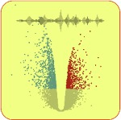

# ggVolcanoR: Visualize differential expression datasets

#### Use app online: __[www.shinyappstore.com/a/ggVolcanoR](https://shinyappstore.com/a/ggVolcanoR)__

ggVolcanoR shiny app allows for customizable generation and visualization of volcano plots, correlation plots, upset plots, and heatmaps for differential expression datasets, via a user-friendly interactive interface in a web-based application without requiring programming expertise. A volcano plot is a visualization tool used in genomics and statistical analysis to identify and visualize differences in gene expression or statistical significance between two conditions. It typically displays log-fold changes on the x-axis and the negative logarithm of the p-values on the y-axis, allowing for a intuitive assessment of which genes or variables exhibit substantial changes in response to a condition. ggVolcanoR offers practical options to optimize the generation of publication-quality volcano and other analytical plots for analyzing and comparing dysregulated genes/proteins across multiple differential expression datasets. Published: Comput Struct Biotechnol J. 2021 Oct 13:19:5735-5740.
